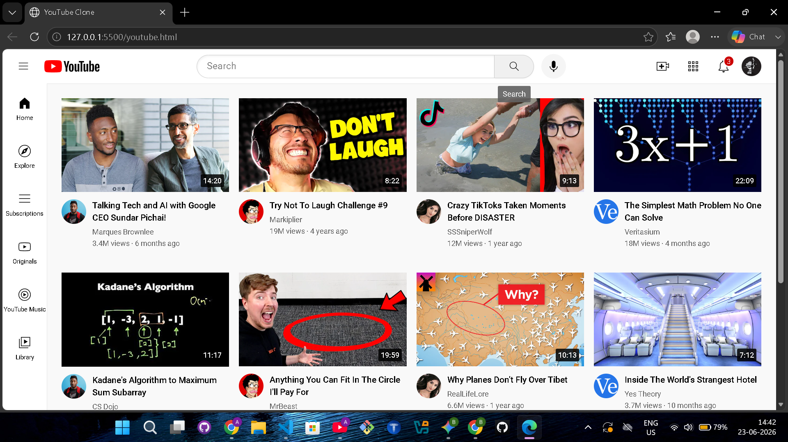

# YouTube Clone

This is a front-end clone of the YouTube homepage, built to practice and showcase my web development skills.

## 🚀 Features
* Responsive layout (Mobile friendly)
* YouTube-like navigation bar and sidebar
* Video grid layout using CSS Flexbox/Grid
* Hover effects on video thumbnails

## 🛠️ Technologies Used
* **HTML5:** For the structure of the web page.
* **CSS3:** For styling, layout, and animations.

## 📸 Screenshots

## 💻 How to Run Locally
1. Clone this repository:
   `git clone https://github.com/anujrawat2007/youtube-clone`
2. Open the folder in your code editor.
3. Open the `youtube.html` file in your browser to view the project.
